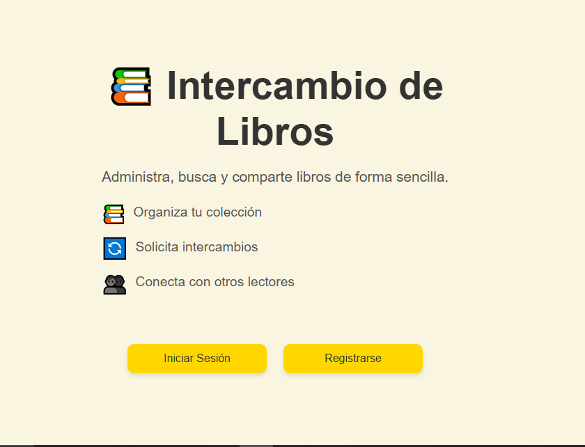
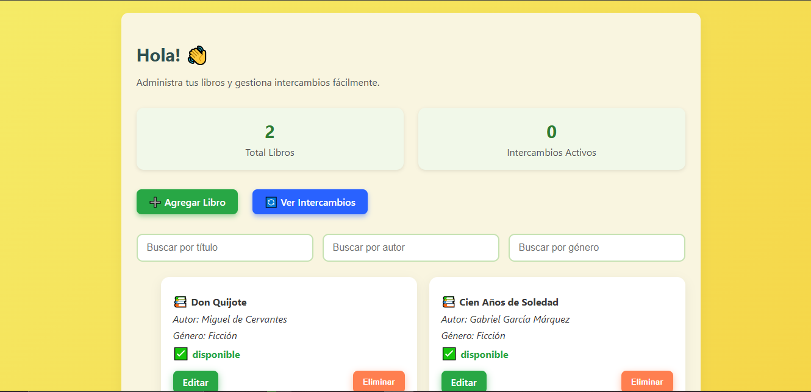

# Intercambio de Libros

**Intercambio de Libros** es una plataforma web que permite a los usuarios gestionar su colección de libros personales y realizar intercambios con otros usuarios. La aplicación permite registrar libros, ver el estado de los intercambios y aceptar o rechazar solicitudes de intercambio.

---

## Características

- **Gestión de Libros**: Agregar, editar, eliminar y listar libros con su estado (disponible, intercambiado, reservado).  
- **Intercambios**: Crear solicitudes de intercambio entre usuarios y gestionarlas (pendiente, aceptado, rechazado).  
- **Autenticación**: Registro, inicio de sesión y acceso a colecciones privadas de libros.  
- **Interfaz Intuitiva**: Diseño moderno y responsivo para una mejor experiencia de usuario.  

---

## Tecnologías Usadas

### Frontend
- **React.js** (con Hooks para gestión de estado)  
- **Axios** para comunicación con el backend  
- **CSS** para el diseño visual  

### Backend
- **NestJS** con Node.js y TypeScript  
- Base de datos relacional con **TypeORM** (PostgreSQL o MySQL)  
- **JWT (JSON Web Tokens)** con Passport.js para autenticación  

### Base de Datos
- **PostgreSQL** o **MySQL** mediante TypeORM

- ## 🔹 Sobre este proyecto

**Mi rol en el proyecto:**
- Desarrollador fullstack: implementé tanto el frontend con React como el backend con NestJS.  
- Diseñé la lógica de gestión de libros y de solicitudes de intercambio.  
- Implementé autenticación segura usando JWT y control de acceso a colecciones privadas.  
- Construí una interfaz moderna y responsiva para mejorar la experiencia del usuario.  

**Aprendizajes clave:**
- Manejo de **estado en React** usando Hooks y comunicación con el backend mediante Axios.  
- Desarrollo de **APIs RESTful** con NestJS y TypeORM.  
- Integración de **autenticación y autorización** segura con JWT y Passport.js.  
- Organización de un proyecto fullstack con frontend y backend separados.  
- Buenas prácticas de documentación y control de versiones con Git y GitHub.  

- ## Capturas de Pantalla

### Pantalla de Inicio

### Gestión de Libros

